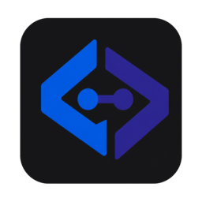

<p align="center">
  <picture>
    <source media="(prefers-color-scheme: dark)" srcset="crates/forge-gui/assets/logo-light.png">
    <source media="(prefers-color-scheme: light)" srcset="crates/forge-gui/assets/logo-dark.png">
    
  </picture>
</p>

<h1 align="center">Forge</h1>

<p align="center">
  A native, git-first IDE for building, running, and maintaining API tests.
  <br>
  The useful parts of Postman and Bruno—without cloud lock-in, repeated assertions, or workspace ceremony.
</p>

<p align="center">
  <a href="https://github.com/EricVogt93/Api-ide/actions/workflows/ci.yml"></a>
  <a href="https://github.com/EricVogt93/Api-ide/actions/workflows/release.yml"></a>
  <a href="LICENSE"></a>
  
</p>

> [!NOTE]
> Forge is under active development. The request format is versioned and validated, but the desktop packages are not code-signed yet.

## Why Forge?

API test tools tend to turn a request into a document full of scripts, copied assertions, hidden state, and team-specific setup. Forge takes the opposite approach:

- **Install, create a project, start working.** Conventional folders and asset paths are generated automatically.
- **Your project is the source of truth.** Requests, environments, hooks, assertions, and metadata are ordinary reviewable files.
- **Reusable behavior stays reusable.** The catalog turns common assertions, extractors, generators, hooks, and mocks into typed references with forms—not pasted code.
- **The IDE and CI run the same core.** The native GUI and headless CLI are adapters around the same Rust execution engine.
- **OpenAPI is active tooling.** Browse operations, generate valid values, complete requests, validate responses, track coverage, and generate test suites.

## Highlights

| Area | What Forge provides |
| --- | --- |
| Project view | File-explorer hierarchy, story folders, Git state, branch/worktree actions, inherited Jira links, recursive formatting and export |
| Request editor | JSON beautification, syntax highlighting, diagnostics, minimap, completion, OpenAPI suggestions, autosave and Zen mode |
| Response tools | Pretty JSON/XML/HTML, raw view, headers, timing, assertions, runtime variables, diagnostics and trace workspace |
| Catalog | Built-ins and project assets grouped by intent: Validate, Prepare, Capture, Generate and Simulate |
| Assertions | Status, headers, timing, body text/regex, JSONPath value/type/length, cookies, JSON Schema and OpenAPI response validation |
| Hooks | Request preparation, response processing, extractors, logs, request diffs and runtime-variable changes |
| Authentication | Basic/Bearer helpers, reusable auth requests, Keycloak/Auth0/Azure presets, expiry-aware refresh before a dependent request |
| AI Advisor | OpenAI-compatible advisor with automatic active-file, sidecar, OpenAPI, project-metadata and nearby-file context; secrets are redacted before sending |
| Protocols | HTTP, GraphQL, WebSocket, SSE and unary gRPC |
| Portability | Lossless Forge bundles, cURL export/import, Postman import, JUnit XML and a headless runner |

## Install

Download the latest package from [GitHub Releases](https://github.com/EricVogt93/Api-ide/releases):

| Platform | Artifact |
| --- | --- |
| Windows x86_64 | `Forge-<version>-windows-x86_64.exe` |
| Linux x86_64 | `Forge-<version>-linux-x86_64.AppImage` |
| macOS Apple Silicon | `Forge-<version>-macOS-arm64.dmg` |

Until signed builds are available, Windows SmartScreen and macOS Gatekeeper may show an unknown-publisher warning. Release assets include SHA-256 checksums.

### Build from source

Install the stable Rust toolchain, then run:

```sh
git clone https://github.com/EricVogt93/Api-ide.git
cd Api-ide
cargo run --release -p forge-gui --bin forge-ide
```

Linux builds also need the native windowing headers:

```sh
sudo apt install cmake pkg-config libgl1-mesa-dev libwayland-dev \
  libx11-dev libxcursor-dev libxi-dev libxkbcommon-dev libxrandr-dev
```

## The zero-config workflow

1. Start Forge.
2. Select **New Project** and choose a directory.
3. Forge creates the conventional project structure and opens the first request.
4. Add story folders and requests from the project tree.
5. Run, inspect, assert, and commit.

There are no separate save-path dialogs for every asset. Paths derive from the selected project node and asset kind.

```text
my-api/
├── project.json
├── requests/
│   └── checkout/
│       ├── create-order.request.json
│       ├── create-order.assertions.json
│       └── create-order.hooks.json
├── assets/
│   ├── assertions/
│   ├── extractors/
│   ├── generators/
│   ├── hooks/
│   └── mocks/
├── environments/
└── specs/
```

Assertions and hooks deliberately live beside a request instead of inside it. The request document remains focused on HTTP data; Forge loads the sidecars as one effective executable request.

## Request format v1

```json
{
  "$schema": "../../schemas/request-v1.schema.json",
  "formatVersion": 1,
  "kind": "request",
  "meta": {
    "id": "checkout.create-order",
    "name": "Create order"
  },
  "bindings": {
    "orderId": { "value": "" }
  },
  "request": {
    "method": "POST",
    "url": "${env.baseUrl}/orders/${bindings.orderId}",
    "headers": [
      { "name": "Content-Type", "value": "application/json" }
    ],
    "body": { "type": "json", "value": { "sku": "ABC-1" } }
  }
}
```

The schemas in [`schemas/`](schemas) define requests and sidecars. The complete design is documented in [Request Format v1](docs/architecture/request-format-v1.md).

## Documentation

The [Forge Wiki](docs/wiki/README.md) is the full product guide. It covers the zero-config workflow, project layout, request and sidecar formats, the catalog, OpenAPI tooling, authentication, the AI Advisor, generated suites, CLI/CI usage, and the hexagonal architecture. Use [Repository Guidelines](AGENTS.md) for contribution rules.

## One catalog, no assertion copy-paste

A catalog entry contains a title, description, intent, execution phase, typed parameters, defaults, and an example. Selecting **Status is**, entering `201`, and inserting it produces a stable reference:

```json
{
  "use": "builtin:assert-status@1",
  "with": { "expected": 201 },
  "enabled": true
}
```

Project-owned assets use the same UI. A JavaScript implementation such as `assets/assertions/customer-shape.js` can have a colocated `customer-shape.meta.json`; every request then references the same implementation while providing its own parameters. Bindings and parameter sources avoid hard-coding variable names between tests.

## OpenAPI, environments, and auth

- Put a spec below `specs/`, configure a project URL, or inherit an OpenAPI source from folder properties.
- Browse operations by method and request shape, generate valid parameter values, add operations to the current request, and see which endpoints are already covered.
- Assign environments at project, folder, or request level; children inherit unless they override.
- Mark an existing request as an auth provider or configure a provider preset. Forge tracks token lifetime and refreshes before a dependent request would outlive the remaining token window.
- Jira links and OpenAPI/environment properties inherit from folders to descendants, keeping story-level setup in one place.

### Generated OpenAPI suites

Select a project folder and open the tools on the right. Forge writes generated output below that folder and keeps hand-written files outside it untouched:

| Generator | Output | Contents |
| --- | --- | --- |
| Contract tests | `contract/` | Runnable requests plus status, content-type and response-schema assertion sidecars |
| API tests | `api/` | Complete operation requests, assertions and an ordered sequence |
| Load & performance | `performance/` | k6 operation data and smoke, load, stress, spike and soak profiles |

Generated folders carry a Forge manifest and can be regenerated. Existing folders without that manifest are never replaced. k6 runs only GET, HEAD and OPTIONS by default:

```sh
cd requests/checkout/performance
k6 run -e BASE_URL=https://api.example.com -e PROFILE=load k6.js
# Explicitly opt in only against disposable test data:
k6 run -e BASE_URL=https://staging.example.com -e INCLUDE_MUTATIONS=true k6.js
```

## CLI

The `forge` binary is suitable for local scripts and CI:

```sh
cargo run -p forge-cli -- validate requests/users/get.request.json --root .
cargo run -p forge-cli -- run-v1 requests/users/get.request.json --root .
cargo run -p forge-cli -- ci requests/checkout --root .
cargo run -p forge-cli -- ci --regression --root .
cargo run -p forge-cli -- run-sequence smoke.sequence.json --root .
cargo run -p forge-cli -- assets .
cargo run -p forge-cli -- export requests/users --format json -o users.forge.json
cargo run -p forge-cli -- export requests/users/get.request.json --format curl -o get-user.sh
cargo run -p forge-cli -- import users.forge.json requests
```

`forge ci` accepts absolute or project-relative request files and folders and always executes the resolved requests as independent tests in stable path order. Mark a request as **Regression test** in its Project-view Properties; `forge ci --regression --root .` then executes only those marked requests and returns CI-friendly exit codes (`0` passed, `1` assertion failure, `2` configuration or execution error). `run-v1` remains available for interactive single requests and explicit multi-file sequences.

Forge checks the latest published GitHub Release at startup. A newer version opens a changelog dialog where it can be downloaded or skipped; downloaded packages are SHA-256 verified before the platform update flow starts. The release workflow publishes updates from version tags matching the Cargo version, such as `v0.2.0`.

Legacy `forge.json` workspaces remain runnable through `forge run`, and `forge migrate` / `forge migrate-all` convert them without silently dropping unsupported fields.

## Architecture

```text
forge-gui ─┐
           ├──> forge-core ──> HTTP, storage, scripting, OpenAPI
forge-cli ─┘
```

- [`forge-core`](crates/forge-core) owns request models, validation, execution, reusable assets, import/export and history.
- [`forge-gui`](crates/forge-gui) is the native `egui` desktop adapter.
- [`forge-cli`](crates/forge-cli) is the headless automation adapter.

The GUI should not reimplement execution rules, and the CLI should not need GUI state. See [Repository Guidelines](AGENTS.md) before contributing.

The AI Advisor follows the same boundary: the GUI assembles a bounded, redacted context while `forge-core` remains the source of truth for request parsing, OpenAPI matching, assets and execution. Provider transport is isolated in `forge-gui/src/advisor.rs` and uses an OpenAI-compatible chat-completions endpoint.

## Development

```sh
cargo fmt --all -- --check
cargo clippy --workspace --all-targets -- -D warnings
cargo test --workspace --locked
cargo build --release --workspace
```

GitHub Actions runs those checks on pull requests and builds the Windows EXE, Linux AppImage, and macOS DMG on version tags. A tag must match the Cargo version, for example `v0.1.0`.

## Security and local state

- `.forge-local/`, `.forge/`, `.env.local`, and `*.secrets.json` are excluded from version control.
- Export bundles omit secrets and runtime state.
- Project JavaScript is disabled until explicitly allowed after review.
- The embedded JavaScript runtime has resource limits and no exposed filesystem, network, or process API; it is not presented as an adversarial security boundary.

## License

Forge is free for personal and other noncommercial use under the
[PolyForm Noncommercial License 1.0.0](LICENSE). Commercial use requires a
separate paid license; see [Commercial Licensing](COMMERCIAL-LICENSE.md).
